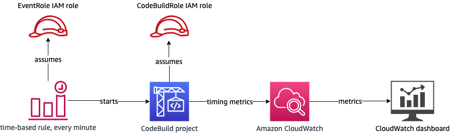

# Creating Custom Tracing Metrics with AWS CodeBuild

This is a Proof of Concept (POC) implementation of custom tracing metrics in AWS CodeBuild, for example to track how long a specific process takes to run across all builds.

## Architecture



## Deployment

### Using the AWS Command Line Interface (CLI)

```shell
aws cloudformation create-stack --stack-name codebuild-metrics-poc --template-body file://codebuild_cloudwatch_timing_metrics.yml --capabilities CAPABILITY_IAM
```

### Using the AWS Console

1. Navigate to the **CloudFormation** Service
2. Select **Create stack** -> **with new resources (standard)
3. Select **Template is ready**, then **Upload a template file**
4. Select **choose file** and navigate to the `codebuild_cloudwatch_timing_metrics.yml` file in this repository.
5. Enter `codebuild-metrics-poc` as the **Stack name**, then click **Next**
6. All defaults should be fine on the next screen for the purposes of this POC deployment, so click **Next**
7. Under **Capabilities**, check the box for **I acknowledge that AWS CloudFormation might create IAM resources.**, since this stack creates two IAM roles: a CodeBuild service role for the project to use, and an Amazon EventBridge service role to give our time-based rule access to start the build.
8. Wait for the CloudFormation stack to finish creating and show a **CREATE_COMPLETE** status

## Security

See [CONTRIBUTING](CONTRIBUTING.md#security-issue-notifications) for more information.

## License

This library is licensed under the MIT-0 License. See the LICENSE file.

